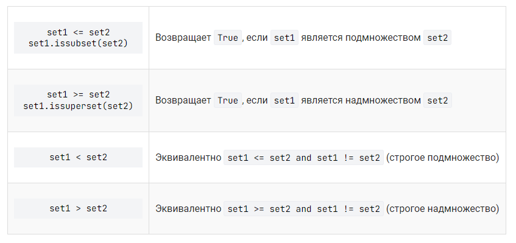

# Множества
`A = {1, 2, 3}`

`A = set('qwerty')`

* каждый элемент может входить в множество только один раз, порядок задания элементов неважен;

* порядок хранения элементов неопределен;

* элементами множества может быть любой неизменяемый тип данных: числа, строки, кортежи;

* множества можно сравнивать между собой.

## Функции
* `len` -  число элементов в множестве;

* `add` - добавление элемента в множество;

* `discard` - удаление элемента x из множества;

* `remove` - удаление элемента x из множества. Генерирует исключение KeyError, если элемент отсутствует;

* `pop` - удаляет из множества один случайный элемент и возвращает его значение. Если же множество пусто, то генерируется исключение KeyError;

* `list` - из множества можно сделать список при помощи функции;

* `in` - проверить, принадлежит ли элемент множеству. Есть противоположная операция `not in`;

* `sum()` - вычисляет сумму его элементов;

* `min()` и `max()` - находят минимальный и максимальный элементы;

* `clear()` - удаляет все элементы из множества.

## Операции с множествами
**A|B &emsp; A.union(B)**

Возвращает множество, являющееся ***объединением*** множеств A и B.

**A |= B &emsp; A.update(B)**

Добавляет в множество A все элементы из множества B.

**A & B &emsp; A.intersection(B)**

Возвращает множество, являющееся ***пересечением*** множеств A и B.

**A &= B &emsp; A.intersection_update(B)**

Оставляет в множестве A только те элементы, которые есть в множестве B.

**A - B  &emsp; A.difference(B)**

Возвращает ***разность множеств*** A и B (элементы, входящие в A, но не входящие в B).

**A -= B &emsp; A.difference_update(B)**

Удаляет из множества A все элементы, входящие в B.

**A ^ B  &emsp; A.symmetric_difference(B)**

Возвращает ***симметрическую разность множеств*** A и B (элементы, входящие в A или в B, но не в оба из них одновременно).

**A ^= B  &emsp; A.symmetric_difference_update(B)**

Записывает в A симметрическую разность множеств A и B.

**A <= B  &emsp; A.issubset(B)**

Возвращает true, если A является подмножеством B.

**A >= B &emsp; A.issuperset(B)**

Возвращает true, если B является подмножеством A.

A < B эквивалентно A <= B and A != B

A > B эквивалентно A >= B and A != B

*Все основные операции над множествами выполнятся двумя способами: при помощи метода или соответствующего ему оператора. Различие в том, что метод может принимать в качестве аргумента не только множество (тип данных set), но и любой итерируемый объект (список, строку, кортеж).*

## Подмножества и надмножества
Любое множество – подмножество самого себя, про такое подмножество говорят "нестрогое подмножество".

Метод `issubset()`, `<=` (нестрогое подмножество), `<` (строгое подмножество) - является ли одно из множеств подмножеством другого.

Метод `issuperset()` - является ли одно из множеств надмножеством другого.

Метод `isdisjoint()` - для определения отсутствия общих элементов в множествах. 

* Методы issuperset(), issubset(), isdisjoint() могут принимать в качестве аргумента не только множество (тип данных set), но и любой итерируемый объект (список, строку, кортеж).

* Операторы >, <, >=, <= требуют наличия в качестве операндов множеств.

&emsp;&emsp;&emsp;&emsp;&emsp;&emsp;&emsp;&emsp;&emsp; Таблица соответствия методов и операторов над множествами.
  

## Генераторы множеств

**Общий вид генератора множеств**

`{выражение for переменная in последовательность}`

где  выражение — некоторое выражение, как правило, зависящее от использованной в списочном выражении переменной, которым будут заполнены элементы множества переменная — имя некоторой переменной, последовательность — последовательность значений, которые она принимает (любой итерируемый объект).

### Примеры использования генератора множеств

1. Создать множество, заполненное кубами целых чисел от 10 до 20 можно так:

`cubes = {i ** 3 for i in range(10, 21)}`

2. Создать множество, заполненное символами строки можно так:

`chars = {c for c in 'abcdefg'}`

### Условия в генераторе множеств

В генераторах множеств можно использовать условный оператор. Например, если требуется создать множество, заполненное только цифрами некоторой строки, то мы можем написать такой код:

`digits = {int(d) for d in 'abcd12ef78ghj90' if d.isdigit()}`

## Frozenset
Замороженное множество (frozenset) также является встроенной коллекцией в Python. Обладая характеристиками обычного множества, замороженное множество не может быть изменено после создания.

*Кортеж* (тип tuple) – *неизменяемая версия списка (тип list)*,

*замороженное множество* (тип frozenset) – неизменяемая версия обычного множества (тип set).

Для создания замороженного множества используется встроенная функция frozenset(), которая принимает в качестве аргумента другую коллекцию.

`myset1 = frozenset({1, 2, 3})                         # на основе множества`

`myset2 = frozenset([1, 1, 2, 3, 4, 4, 4, 5, 6, 6])    # на основе списка`

`myset3 = frozenset('aabcccddee')                      # на основе строки`

### Операции над замороженными множествами

* объединение множеств: метод union() или оператор |;
* пересечение множеств: метод intersection() или оператор &;
* разность множеств: метод difference() или оператор -;
* симметрическая разность множеств: метод symmetric_difference() или оператор ^.

### Примечания

* *Примечание 1*. Будучи изменяемыми, обычные множества не могут быть элементами других множеств. Замороженные множества являются неизменяемыми, а значит могут быть элементами других множеств.

Приведенный ниже код:

sentence = 'The cat in the hat had two sidekicks, thing one and thing two.'

words = sentence.lower().replace('.', '').replace(',', '').split()

vowels = ['a', 'e', 'i', 'o', 'u']

consonants = {frozenset({letter for letter in word if letter not in vowels}) for word in words}

print(*consonants, sep='\n')
выводит (порядок элементов может отличаться):

frozenset({'d', 'h'})
frozenset({'h', 't'})
frozenset({'n', 'h', 'g', 't'})
frozenset({'n'})
frozenset({'c', 't'})
frozenset({'n', 'd'})
frozenset({'w', 't'})
frozenset({'s', 'c', 'k', 'd'})

* *Примечание 2*. Методы изменяющие множество отсутствуют у замороженных множеств:

add()
remove()
discard()
pop()
clear()
update()
intersection_update()
difference_update()
symmetric_difference_update()
Примечание 3. Мы можем сравнивать простые (тип set) и замороженные множества (тип frozenset).

Приведенный ниже код:

myset1 = set('qwerty')
myset2 = frozenset('qwerty')

print(myset1 == myset2)
выведет:

True